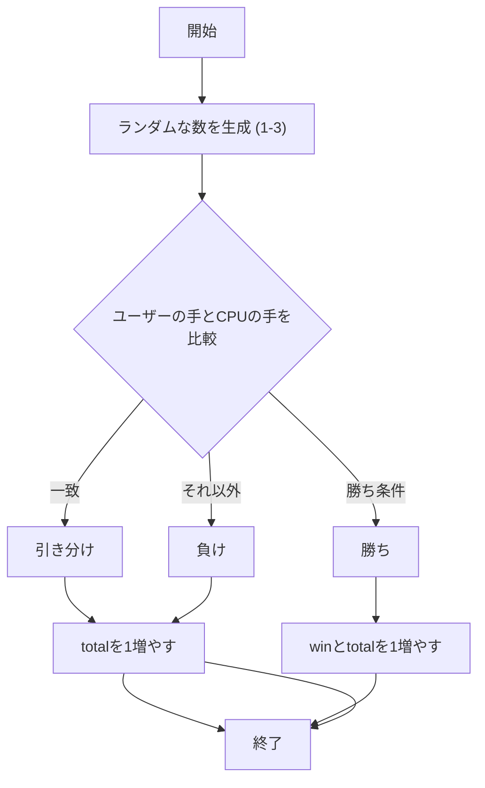
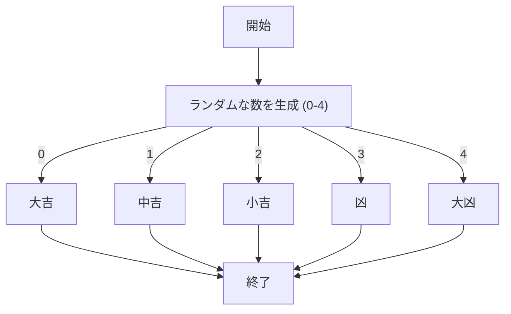
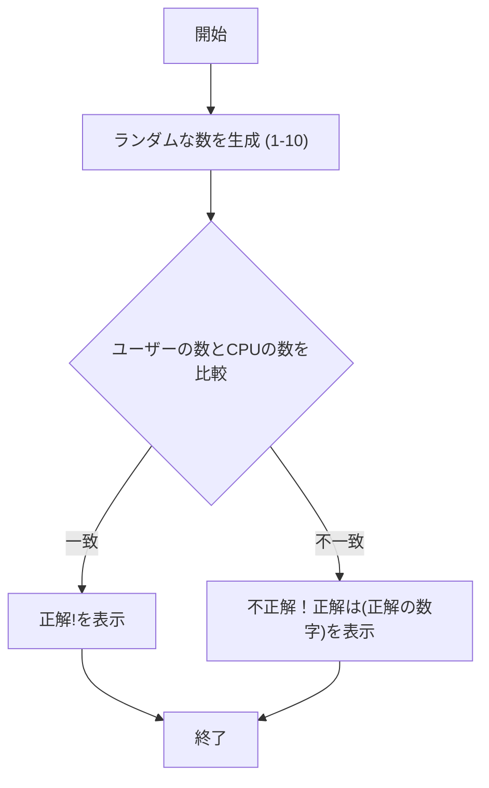

# webpro_06

## このプログラムについて

起動方法  
適切なディレクトリで node app5.js でサーバを起動する.  
次に下に示したURLを開くと起動できる.  

じゃんけんのURL  
http://localhost:8080/janken  
おみくじのURL  
http://localhost:8080/omikuji  
数当てゲームのURL  
http://localhost:8080/number_guess  

##　ファイル一覧

ファイル名 | 説明
-|-
app5.js | プログラム本体
janken.ejs | じゃんけん結果を表示するテンプレート
omikuji.ejs | おみくじ結果を表示するテンプレート
number_guess.ejs | 数当てゲームを実行するテンプレート

<b>app5.js</b>

このプログラムについて説明する.
このプログラムはプログラム本体であり，3つのユーザからの入力に対して結果を返す機能がある.
1つ目がじゃんけん，2つ目がおみくじ，3つ目が数当てゲームである.以下にapp5.jsの3つのミニゲーム部分のコードを記載している.

```javascript
const express = require("express");
const app = express();

app.set('view engine'， 'ejs');
app.use("/public"， express.static(__dirname + "/public"));

// じゃんけんのルート
app.get("/janken"， (req， res) => {
  let hand = req.query.hand;
  let win = Number(req.query.win);
  let total = Number(req.query.total);
  const num = Math.floor(Math.random() * 3 + 1);
  let cpu = num === 1 ? 'グー' : num === 2 ? 'チョキ' : 'パー';

  let judgement = '';
  if (hand === cpu) {
    judgement = '引き分け';
    total += 1;
  } else if (
    (hand === 'グー' && cpu === 'チョキ') ||
    (hand === 'チョキ' && cpu === 'パー') ||
    (hand === 'パー' && cpu === 'グー')
  ) {
    judgement = '勝ち';
    win += 1;
    total += 1;
  } else {
    judgement = '負け';
  }
  total += 1;

  res.render('janken'， {
    your: hand，
    cpu: cpu，
    judgement: judgement，
    win: win，
    total: total
  });
});

// おみくじのルート
app.get("/omikuji"， (req， res) => {
  const unsei = ["大吉"， "中吉"， "小吉"， "凶"， "大凶"];
  const un = unsei[Math.floor(Math.random() * unsei.length)];
  res.render("omikuji"， { un });
});

// 数当てゲームのルート
app.get("/number_guess"， (req， res) => {
  const userNumber = Number(req.query.number);
  const targetNumber = Math.floor(Math.random() * 10) + 1; // 1~10のランダムな数字
  let result = "";

  if (!isNaN(userNumber)) {
    if (userNumber === targetNumber) {
      result = "正解！";
    } else {
      result = `不正解！正解は ${targetNumber} `;
    }
  }

  res.render("number_guess"， { result });
});

app.listen(8080， () => console.log("Example app listening on port 8080!"));
```

まず，じゃんけんの機能について説明する.以下にじゃんけんのコードの部分を記載している.

```javascript
// じゃんけんのルート
app.get("/janken"， (req， res) => {
  let hand = req.query.hand;
  let win = Number(req.query.win);
  let total = Number(req.query.total);
  const num = Math.floor(Math.random() * 3 + 1);
  let cpu = num === 1 ? 'グー' : num === 2 ? 'チョキ' : 'パー';

  let judgement = '';
  if (hand === cpu) {
    judgement = '引き分け';
    total += 1;
  } else if (
    (hand === 'グー' && cpu === 'チョキ') ||
    (hand === 'チョキ' && cpu === 'パー') ||
    (hand === 'パー' && cpu === 'グー')
  ) {
    judgement = '勝ち';
    win += 1;
    total += 1;
  } else {
    judgement = '負け';
  }
  total += 1;

  res.render('janken'， {
    your: hand，
    cpu: cpu，
    judgement: judgement，
    win: win，
    total: total
  });
});
```

app.get("/janken"， ...) によって /janken というルートを定義している.ユーザーが /janken にアクセスすると，この関数が実行される.
req.query.hand で，ユーザーが出した手（グー，チョキ，パー）を取得する.
req.query.win と req.query.total で，これまでの勝利数 (win) と試合数 (total) を取得する.数値として扱いたいため，Number(...) を使って数値に変換している.  
Math.random() を使用して 1 から 3 のランダムな整数 (num) を生成する.  
num が 1 のときは「グー」，2 のときは「チョキ」，3 のときは「パー」として cpu に代入する.  
judgement は結果（勝敗）を格納するための変数である.  
まず，ユーザーとコンピュータの手が同じかどうかを確認し，同じ場合は「引き分け」に設定する.  
次に，ユーザーが勝利した場合，judgement を「勝ち」に設定し，勝利数 (win) を 1 増やす.  
上記のいずれにも当てはまらない場合は，judgement を「負け」に設定する.
試合を行ったので，合計試合数 (total) を 1 増やす.  
res.render(...) を使って，janken.ejs テンプレートに結果データを渡し，画面に表示する.  



次に，おみくじの機能について説明する.以下におみくじのコードの部分を記載している.

```javascript
// おみくじのルート
app.get("/omikuji"， (req， res) => {
  const unsei = ["大吉"， "中吉"， "小吉"， "凶"， "大凶"];
  const un = unsei[Math.floor(Math.random() * unsei.length)];
  res.render("omikuji"， { un });
});
```

app.get("/omikuji"， ...) によって /omikuji というルートを定義している.ユーザーが /omikuji にアクセスすると，この関数が実行される.  
unseiという配列にはおみくじの結果となる5つの運勢が含まれている.この中からランダムに1つの結果を選んで返す.  
Math.random()の値に unsei.length（配列の要素数，ここでは5）を掛けることで，0以上5未満のランダムな数値が得られる.Math.floor()を使って整数に切り捨てると，0から4の範囲の整数がランダムに得られる.この整数をインデックスとしてunsei配列から要素を取り出し，un変数に格納する.  
最後に，un変数をテンプレートに渡して，おみくじの結果を表示するomikuji.ejsテンプレートを表示する.unはテンプレート内で <%= un %> のようにして参照され，ランダムに選ばれた運勢が表示される.  



そして，数当てゲームの機能について説明する.以下に数当てゲームのコードの部分を記載している.

```javascript
// 数当てゲームのルート
app.get("/number_guess"， (req， res) => {
  const user = Number(req.query.number);
  const target = Math.floor(Math.random() * 10) + 1; // 1~10のランダムな数字
  let result = "";

  if (!isNaN(user)) {
    if (user === target) {
      result = "正解!";
    } else {
      result = `不正解!正解は ${target}`;
    }
  }

  res.render("number_guess"， { result });
});
```

app.get("/number_guess"， ...) によって /number_guess というルートを定義している.ユーザーが /number_guess にアクセスすると，この関数が実行される.  
req.query.number で，クエリパラメータとしてユーザーが入力した number の値を取得し，Number(...) によって，数値型に変換する.  
Math.random() * 10 で 0〜9.999... の範囲の小数が生成され，それを Math.floor(...) で切り捨て，最後に + 1 することで，1〜10の範囲のランダムな整数 target が得られる.  
result は，ユーザーに表示するメッセージを保持する変数である.  
if (!isNaN(user)) で，ユーザー入力が数値かどうかを確認する.  
if (user === target) では，ユーザーの入力値とターゲットナンバーが等しいかを判定し，正解なら result に"正解!"というメッセージを設定する.
不正解の場合は，"不正解！正解は(正解の数字)"が result に設定される.
res.render(...)で，number_guess.ejs テンプレートが表示される.
{ result } によって，テンプレートに result の値が渡され，数当ての結果メッセージが表示される.  



<b>janken.ejs</b>

このファイルはじゃんけん結果を表示するテンプレートである.

```javascript
<p>あなたの手は<%= your %>です.</p>
<p>コンピュータは<%= cpu %>です.</p>
<p>判定：<%= judgement %></p>
<p>現在<%= total %>試合中<%= win %>勝しています.</p>
```

これらの行はゲームの結果をユーザーに表示する部分である.

```javascript
<form action="/janken">
    <label for="hand">次は何を出す？</label>
    <input type="text" id="hand" name="hand" required>
    <input type="hidden" name="win" value="<%= win %>">
    <input type="hidden" name="total" value="<%= total %>">
    <button type="submit">じゃんけん ポン</button>
</form>
```
ユーザーが次に出す手を入力するフォームである.

```javascript
<nav>
    <a href="/omikuji">おみくじ</a> |
    <a href="/number_guess">数当てゲーム</a>
</nav>
```

ゲーム後に他のゲームやページに移動できるリンクである.

<b>omikuji.ejs</b>

このファイルはおみくじ結果を表示するテンプレートである.

```javascript
<p>あなたの運勢は <strong><%= un %></strong> です！</p>
```
ユーザーの運勢を表示する部分である.

```javascript
<form action="/omikuji">
    <button type="submit">もう一度引く</button>
</form>
```

ユーザーがもう一度おみくじを引けるようにするボタンである.

```javascript
<nav>
    <a href="/janken">じゃんけん</a> |
    <a href="/number_guess">数当てゲーム</a>
</nav>
```

ユーザーが他のゲームに移動できるリンクである.

<b>number_guess.ejs</b>

このファイルは数当てゲームを実行するテンプレートである.

```javascript
<p>1〜10の中で数字を当ててください！</p>
```

ユーザーにゲームの説明を行っている.

```javascript
<form action="/number_guess" method="get">
    <input type="number" name="number" min="1" max="10" required>
    <button type="submit">送信</button>
</form>
```

ユーザーが数字を入力するフォームである.

```javascript
<% if (result) { %>
    <p><%= result %></p>
<% } %>
```

もしresultという変数が存在する場合その値を表示する部分である.

```javascript
<nav>
    <a href="/janken">じゃんけん</a> |
    <a href="/omikuji">おみくじ</a>
</nav>
```

ユーザーが他のゲームに移動できるリンクである.