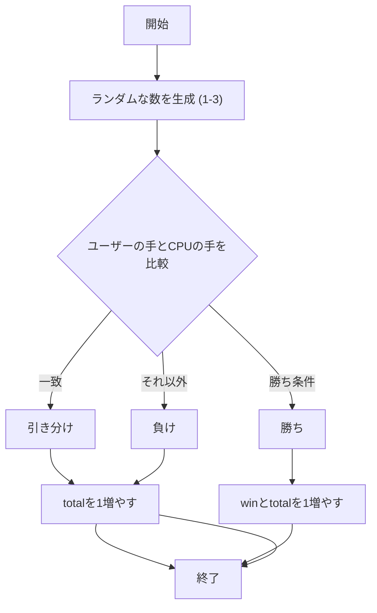
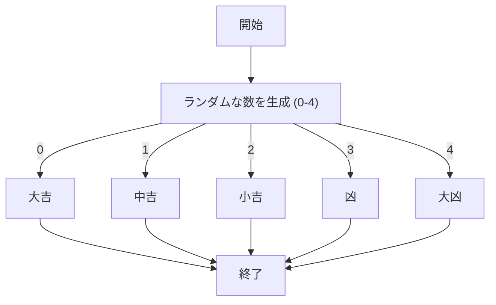
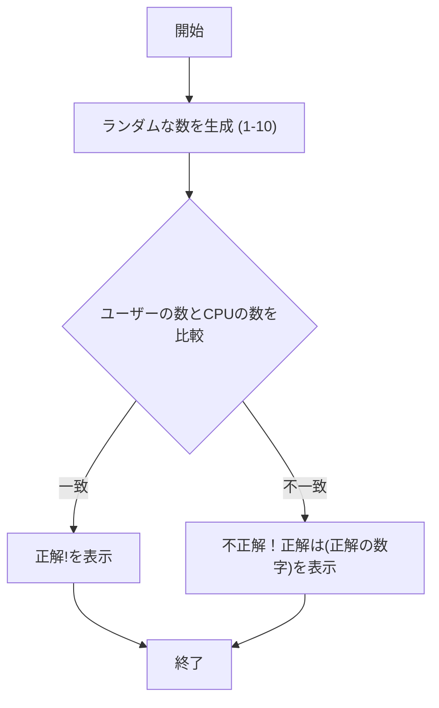

# webpro_06

## このプログラムについて

じゃんけんのURL
http://localhost:8080/janken
おみくじのURL
http://localhost:8080/omikuji
数当てゲームのURL
http://localhost:8080/number_guess

##　ファイル一覧

ファイル名 | 説明
-|-
app5.js | プログラム本体
janken | じゃんけんの開始画面
omikuji | おみくじの開始画面
number_guess | 数当てゲームの開始画面

app5.js

```javascript
const express = require("express");
const app = express();

app.set('view engine', 'ejs');
app.use("/public", express.static(__dirname + "/public"));

app.get("/hello1", (req, res) => {
  const message1 = "Hello world";
  const message2 = "Bon jour";
  res.render('show', { greet1:message1, greet2:message2});
});

app.get("/hello2", (req, res) => {
  res.render('show', { greet1:"Hello world", greet2:"Bon jour"});
});

app.get("/icon", (req, res) => {
  res.render('icon', { filename:"./public/Apple_logo_black.svg", alt:"Apple Logo"});
});

app.get("/luck", (req, res) => {
  const num = Math.floor( Math.random() * 6 + 1 );
  let luck = '';
  if( num==1 ) luck = '大吉';
  else if( num==2 ) luck = '中吉';
  console.log( 'あなたの運勢は' + luck + 'です' );
  res.render( 'luck', {number:num, luck:luck} );
});

// じゃんけんのルート
app.get("/janken", (req, res) => {
  let hand = req.query.hand;
  let win = Number(req.query.win);
  let total = Number(req.query.total);
  const num = Math.floor(Math.random() * 3 + 1);
  let cpu = num === 1 ? 'グー' : num === 2 ? 'チョキ' : 'パー';

  let judgement = '';
  if (hand === cpu) {
    judgement = '引き分け';
    total += 1;
  } else if (
    (hand === 'グー' && cpu === 'チョキ') ||
    (hand === 'チョキ' && cpu === 'パー') ||
    (hand === 'パー' && cpu === 'グー')
  ) {
    judgement = '勝ち';
    win += 1;
    total += 1;
  } else {
    judgement = '負け';
  }
  total += 1;

  res.render('janken', {
    your: hand,
    cpu: cpu,
    judgement: judgement,
    win: win,
    total: total
  });
});

// おみくじのルート
app.get("/omikuji", (req, res) => {
  const unsei = ["大吉", "中吉", "小吉", "凶", "大凶"];
  const un = unsei[Math.floor(Math.random() * unsei.length)];
  res.render("omikuji", { un });
});

// 数当てゲームのルート
app.get("/number_guess", (req, res) => {
  const userNumber = Number(req.query.number);
  const targetNumber = Math.floor(Math.random() * 10) + 1; // 1~10のランダムな数字
  let result = "";

  if (!isNaN(userNumber)) {
    if (userNumber === targetNumber) {
      result = "おめでとう！正解です！";
    } else {
      result = `残念！正解は ${targetNumber} でした.`;
    }
  }

  res.render("number_guess", { result });
});

app.listen(8080, () => console.log("Example app listening on port 8080!"));
```

このプログラムについて説明する.

```javascript
// じゃんけんのルート
app.get("/janken", (req, res) => {
  let hand = req.query.hand;
  let win = Number(req.query.win);
  let total = Number(req.query.total);
  const num = Math.floor(Math.random() * 3 + 1);
  let cpu = num === 1 ? 'グー' : num === 2 ? 'チョキ' : 'パー';

  let judgement = '';
  if (hand === cpu) {
    judgement = '引き分け';
    total += 1;
  } else if (
    (hand === 'グー' && cpu === 'チョキ') ||
    (hand === 'チョキ' && cpu === 'パー') ||
    (hand === 'パー' && cpu === 'グー')
  ) {
    judgement = '勝ち';
    win += 1;
    total += 1;
  } else {
    judgement = '負け';
  }
  total += 1;

  res.render('janken', {
    your: hand,
    cpu: cpu,
    judgement: judgement,
    win: win,
    total: total
  });
});
```

この部分について説明する.
app.get("/janken", ...) によって /janken というルートを定義している.ユーザーが /janken にアクセスすると,この関数が実行される.
req.query.hand で,ユーザーが出した手（グー,チョキ,パー）を取得する.
req.query.win と req.query.total で,これまでの勝利数 (win) と試合数 (total) を取得する.数値として扱いたいため,Number(...) を使って数値に変換している.
Math.random() を使用して 1 から 3 のランダムな整数 (num) を生成する.
num が 1 のときは「グー」,2 のときは「チョキ」,3 のときは「パー」として cpu に代入する.
judgement は結果（勝敗）を格納するための変数である.
まず,ユーザーとコンピュータの手が同じかどうかを確認し,同じ場合は「引き分け」に設定する.
次に,ユーザーが勝利した場合,judgement を「勝ち」に設定し,勝利数 (win) を 1 増やす.
上記のいずれにも当てはまらない場合は,judgement を「負け」に設定する.
試合を行ったので,合計試合数 (total) を 1 増やす.
res.render(...) を使って,janken.ejs テンプレートに結果データを渡し,画面に表示する.



```javascript
// おみくじのルート
app.get("/omikuji", (req, res) => {
  const unsei = ["大吉", "中吉", "小吉", "凶", "大凶"];
  const un = unsei[Math.floor(Math.random() * unsei.length)];
  res.render("omikuji", { un });
});
```

この部分について説明する.
app.get("/omikuji", ...) によって /omikuji というルートを定義している.ユーザーが /omikuji にアクセスすると,この関数が実行される.
unseiという配列にはおみくじの結果となる5つの運勢が含まれている.この中からランダムに1つの結果を選んで返す.
Math.random()の値に unsei.length（配列の要素数,ここでは5）を掛けることで,0以上5未満のランダムな数値が得られる.Math.floor()を使って整数に切り捨てると,0から4の範囲の整数がランダムに得られる.この整数をインデックスとしてunsei配列から要素を取り出し,un変数に格納する.
最後に,un変数をテンプレートに渡して,おみくじの結果を表示するomikuji.ejsテンプレートを表示する.unはテンプレート内で <%= un %> のようにして参照され,ランダムに選ばれた運勢が表示される.



```javascript
// 数当てゲームのルート
app.get("/number_guess", (req, res) => {
  const user = Number(req.query.number);
  const target = Math.floor(Math.random() * 10) + 1; // 1~10のランダムな数字
  let result = "";

  if (!isNaN(user)) {
    if (user === target) {
      result = "正解!";
    } else {
      result = `不正解!正解は ${target}`;
    }
  }

  res.render("number_guess", { result });
});
```

この部分について説明する.
app.get("/number_guess", ...) によって /number_guess というルートを定義している.ユーザーが /number_guess にアクセスすると,この関数が実行される.
req.query.number で,クエリパラメータとしてユーザーが入力した number の値を取得し,Number(...) によって,数値型に変換する.
Math.random() * 10 で 0〜9.999... の範囲の小数が生成され,それを Math.floor(...) で切り捨て,最後に + 1 することで,1〜10の範囲のランダムな整数 target が得られる.
result は,ユーザーに表示するメッセージを保持する変数である.
if (!isNaN(user)) で,ユーザー入力が数値かどうかを確認する.
if (user === target) では,ユーザーの入力値とターゲットナンバーが等しいかを判定し,正解なら result に"正解!"というメッセージを設定する.
不正解の場合は,"不正解！正解は(正解の数字)"が result に設定される.
res.render(...) で,number_guess.ejs テンプレートが表示される.
{ result } によって,テンプレートに result の値が渡され,数当ての結果メッセージが表示される.



起動方法
適切なディレクトリで node app5.js でサーバを起動する.
次に最初に示したURLを開くと起動できる.